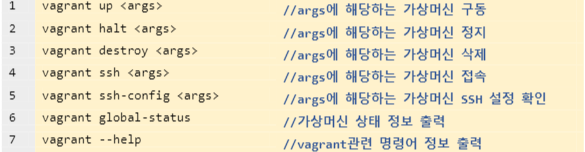

# eth-explorer-base
Base Project for 1주차 이더리움 익스플로러 

#### 기술 스택

* Vue.js
* web3
* bootstrap

# 블록체인 프로젝트

[TOC]

## 0. 개념 이해

### 1) VirtualBox

- 가상화를 위한 소프트웨어이다.
- 가상화란?
  - 컴퓨터 리소스의 추상화를 일컫는 광범위한 용어이다.
  - 다양한 의존성을 가진 소프트웨어를 구동할 수 있다.
  - 소프트웨어를 하드웨어로부터 독립시켜 구동할 수 있는 기술이다.
  - 하드웨어 가상화(Hypervisor) : 하이퍼바이져를 이용한 하드웨어 가상화에 대한 실습을 배울 예정

### 2) Vagrant

- 가상머신에 대한 프로비저닝(Provisioning)을 지원하는 도구이다.
- 스크립트 작성을 통해 가상머신을 쉽게 생성, 수정, 삭제, 관리할 수 있습니다.
- 프로비저닝이란?(Provisioning)
  - 사용자의 요구에 맞게 미리 시스템 자원을 정의하고 할당 및 베포하였다가 
    필요 시 시스템을 즉시 사용할 수 있도록 준비해두는 것을 말한다.
- <u>설정 파일 하나로 모든 가상머신을 통합 관리할 수 있다는 장점이 있다.</u>



### 3) Geth

- 이더리움에서 제공하는 다양한 API를 사용해볼 수 있다.

### 4) Solidity

- 스마트 컨트랙트 개발 언어
- 튜링완전하다란?(Turing-complete)
  - 프로그래밍 언어나 추상 기계가 튜링 기계와 동일한 계산 능력을 가진다는 의미
  - 계산적인 문제를 그 프로그래밍 언어로 풀 수 있다는 의미

### 5) Remix

- 브라우저 상에서 이용가능한 이더리움 스마트 컨트랙트 개발 도구이다.
- JSVM을 통한 스마트 컨트랙트의 사전 테스트, 베포, 호출을 진행해볼 수 있다.
- 스마트 컨트랙트에 소요되는 Gas를 미리 예상해볼 수 있고, UI를 통한 손쉬운 호출로 이더리움 스마트 컨트랙트를 개발하기에 좋은 도구이다.

### 6) Metamask

- 이더리움 지갑 프로그램의 일종이다. 
- 크롬 확장 프로그램으로 설치가능하다.
- [설치경로](https://chrome.google.com/webstore/detail/metamask/nkbihfbeogaeaoehlefnkodbefgpgknn)

## 1. 하이퍼레저 패브릭 프로젝트

### 1) 개요

- 대표적인 허가형 블록체인, 기업형 블록체인 솔루션으로 알려져있다.
- 체인 코드를 작성해보고 베포해보자.
- 패브릭 네트워크란?
  - 기업형 블록체인의 대표주자.
  - 기업간 시너지를 이끌어내기 위한 블록체인 인프라이다.
  - 완벽한 탈 중앙화는 아님
  - 기업 주도 하에 시장 및 비용의 효율성을 창출하는데 초점을 맞춘 블록체인 기술
  - 참여자간 완전한 분산, 분권화를 지향하는 비허가형 블록체인과는 구성 및 동작방식이 상이하다
  - 네트워크에 진입하기 위한 인증절차 존재.
  - 이러한 인증절차를 통해 구성된 네트워크를 패브릭에서는 '비즈니스 네트워크(Business Network)' 라고 말한다
  - 합의 과정을 정렬 서비스라고 말하며 빠른 거래 검증 및 블록 생성을 지원하고 있다.

### 2) 목적

- 비즈니스 네트워크를 위해 가상의 컨소시엄을 만들자
- 패브릭 네트워크를 구성하자
- 가상의 조직(기업)간의 탈중앙화 협업 모델을 구축해보자

### 3) 기술 스택 및 툴의 특징

- 카프카(Kafka)
  - 분산 메세징, 메세지 큐 기술
  - 넷플릭스, 트위터, 텀블러
  - 실시간 대용량 메세지 및 데이터 처리가 필요한 서비스에 중요한 기술이다
  - 발행-구독 모델사용하여 분산 메세징 서비스 제공
  - 주제(Topic) 별 메세지 분류
    - 주제별로 분류된 메세지는 다시 파티션(Partition)으로 쪼개어 관리하는 특징
- Docker, Docker-compose
  - OS 수준 가상화 프로그램
  - 도커에서 구동하는 프로그램이 요구하는 수준의 리소스만을 할당해준다.
  - 독립적 구동으로 성능 손실이 발생하지 않는다


## 블록체인 실습

[TOC]

## 0. 환경 설정

### 0. 준비하기

- vagrant 설치
- virtualbox 설치
- visual studio code 설치

### 1. 가상머신 5개 생성해보기

- /c/dev/eth_prac001 의 경로로 이동해서
- Vagrantfile 에 다음과 같이 루비 언어로 코드 입력

```ruby
# -*- mode: ruby -*-
# vi: set ft=ruby :

# All Vagrant configuration is done below. The "2" in Vagrant.configure
# configures the configuration version (we support older styles for
# backwards compatibility). Please don't change it unless you know what
# you're doing.

VAGRANTFILE_API_VERSION = "2"

vms = {
  eth00: ['10', 4096],
  eth01: ['11', 4096],
  eth02: ['12', 2048],
  eth03: ['13', 2048],
  eth04: ['14', 2048],
}

Vagrant.configure(VAGRANTFILE_API_VERSION) do |config|
  config.vm.box = "ubuntu/bionic64"
  vms.map do |key, value|
    name = key.to_s
    ip_num, mem = value
    config.vm.define "#{name}" do |node|
      node.vm.network "private_network", ip: "192.168.50.#{ip_num}"
      node.vm.hostname = "#{name}"
      node.vm.provider "virtualbox" do |nodev|
        nodev.memory = "#{mem}"
      end
    end
  end
end

```

다음과 같은 파일 작성. 파일은 루비로 작성되어있다.

```
vagrant up
```

와 같이 명령어 입력하면, 5개의 virtual machine이 구동된다. 가상머신이 없다면 가상머신이 설치된다.

- 각각 5개의 가상머신에 대하여 명령어 작성해준다.

```bash
vagrant ssh eth00
```

- 가상머신 접속 명령어이다. 각각의 bash 창 열고 eth01, eth02, eth03, eth04까지 다 실시해준다.

### 2. 별도의 가상머신 접속 및 이더리움 설치

- 각각의 가상머신에 대하여 명령어를 입력해준다.

```bash
sudo apt-get update
sudo apt-get install software-properties-common
sudo add-apt-repository -y ppa:ethereum/ethereum
sudo apt-get install ethereum
버전 뜨는지 확인: geth version
```

### 3. 가상머신 내 디렉토리 생성 및 GENESIS 블록파일 생성

- 마찬가지로 각각의 가상머신에 대하여 명령어를 실시한다.

```bash
mkdir -p /home/vagrant/dev/eth_localdata/ 
cd /home/vagrant/dev/eth_localdata/
sudo vi CustomGenesis.json
밑에꺼 json파일에 붙여넣기
{
  "config": {
        "chainId": 15150,
        "homesteadBlock": 0,
        "eip155Block": 0,
        "eip158Block": 0
    },
  "alloc"      : {},
  "coinbase"   : "0x0000000000000000000000000000000000000000",
  "difficulty" : "0x10",
  "extraData"  : "",
  "gasLimit"   : "9999999",
  "nonce"      : "0xdeadbeefdeadbeef",
  "mixhash"    : "0x0000000000000000000000000000000000000000000000000000000000000000",
  "parentHash" : "0x0000000000000000000000000000000000000000000000000000000000000000",
  "timestamp"  : "0x00"
}

geth --datadir /home/vagrant/dev/eth_localdata/ init /home/vagrant/dev/eth_localdata/CustomGenesis.json
sudo apt install tree
파일 구조 확인 : tree
```

### 4. Go Ethereum 구동

- 명세서 상에서는 eth02를 메인 노드로 지정하고 있다.


```bash
메인서버에서 실행:geth --networkid 15150 --datadir ~/dev/eth_localdata --port 30303 --rpc --rpcport 8545 --rpcaddr 0.0.0.0 --rpccorsdomain "*" --rpcapi  "admin,net,miner,eth,rpc,web3,txpool,debug,db,personal" --allow-insecure-unlock console

다른서버: geth --networkid 15150 --maxpeers 5 --datadir /home/vagrant/dev/eth_localdata/ --port 30304 --allow-insecure-unlock console

노드 정보 확인: admin.nodeInfo.enode 치고 주소 복사한후  admin.addPeer("") 복사한 주소 뒷부분 연결하고자 하는 주소로 바꿔줌 admin.peers로 확인 

```


- 최종적으로 이런식으로 프라이빗 노드를 구축하면 완성!

## 1. 프론트엔드와 노드 네트워크 연동

대장 노드의 아이피를 기억하자.(192.168.50.12) 포트번호는 8545이다. (이더리움 구동시 메인 서버의 포트번호라고 한다)

```bash
personal.newAccount()
패스워드 입력
패스워드 반복입력
miner.start(1)
```

채굴이 시작되었다.

- 스켈레톤 코드의 app.js 이동


- 대장 노드의 아이피와 포트로 수정해준다.


## 2. 이더 트랜잭션하기

https://allg.tistory.com/44 --> 다 나와있음

- EOA 계정 생성

```bash
personal.newAccount("pass0")
```

- EOA 계정 확인

```bash
eth.accounts
eth.accounts[0]
eth.accounts[1]

```

- 트랜잭션 하기

```bash
eth.sendTransaction({from:eth.accounts[0], to:eth.accounts[1], value:web3.toWei(1, "ether")})

```

- 비밀번호가 걸려있다. 이를 해제해주자.

```bash
personal.unlockAccount(eth.accounts[0])
```

- 해제되었으니 송금해주자.


- 송금이 완료되어 트랜잭션에 반영되었다.

